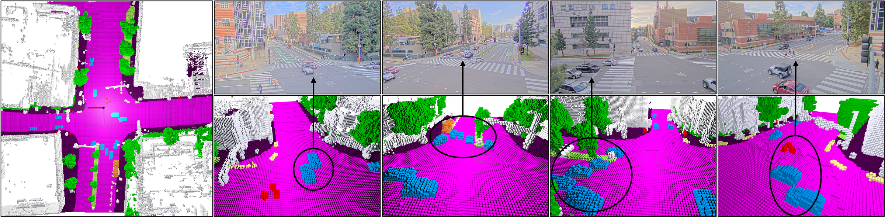
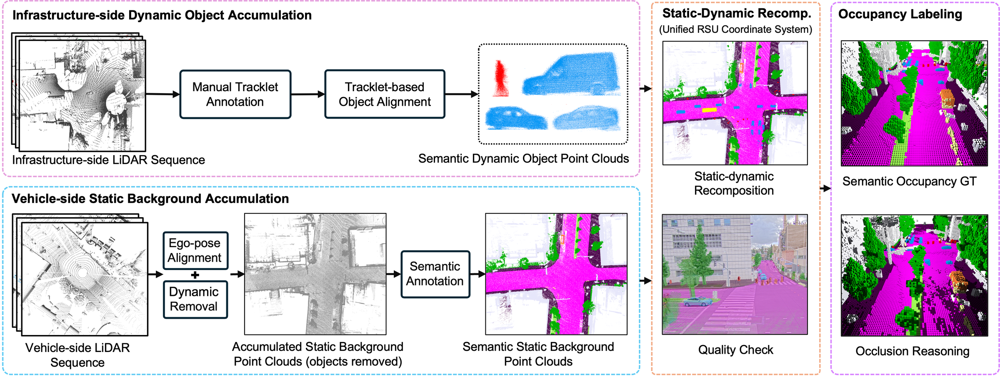
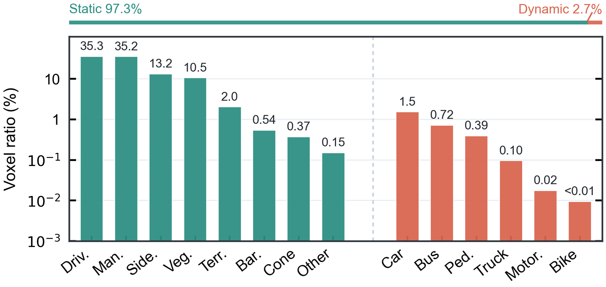
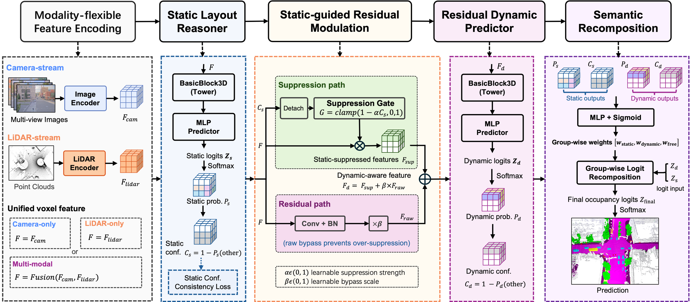
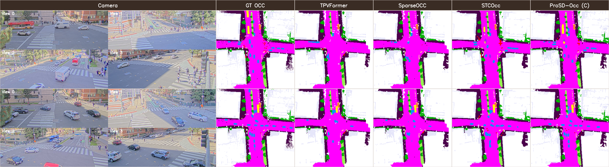

<div align="center">
  <h1>InfraOcc: An Infrastructure Occupancy Benchmark with Static-to-Dynamic Reasoning</h1>

  <p>
    Lei Yang*, Xiaokai Bai*, Boqi Li, Chunmian Lin, Li Wang, Ziying Song,<br>
    Jiahuan Zhang, Enhui Ma, Haibao Yu, Jiaqi Ma, and Kaicheng Yu
  </p>

  <p>
    <a href="https://github.com/yanglei18/InfraOcc">Code</a> |
    <a href="docs/guidance/Install_cu128.md">Installation</a> |
    <a href="docs/guidance/dataset.md">Dataset Preparation</a> |
    <a href="projects/InfraOcc/configs/main_table/README.md">Training & Evaluation</a>
  </p>
</div>

<p align="center">
  
  <br>
  <sub><b>Representative InfraOcc keyframe.</b> Synchronized roadside views are associated with dense semantic occupancy in a fixed infrastructure coordinate system.</sub>
</p>

## 🗓️ News

- **2026.07.01:** Paper submitted.
- **2026.04.29:** InfraOcc project initiated.

## 📖 Abstract

Semantic occupancy prediction provides a unified 3D representation of free
space, static layout, and dynamic traffic participants. Existing benchmarks and
methods are predominantly designed for moving ego vehicles. Infrastructure
sensors instead observe the same traffic space from fixed viewpoints, where a
near-persistent static scaffold coexists with sparse and short-lived dynamic
events. Treating this setting as ordinary ego-centric occupancy overlooks its
distinct spatial and temporal structure.

We introduce **InfraOcc**, a real-world infrastructure-side semantic occupancy
benchmark with dense voxel annotations in a fixed roadside coordinate system.
InfraOcc provides a static-dynamic decoupled annotation pipeline and a unified
protocol for camera-only, LiDAR-only, and multi-modal occupancy prediction. It
also separates static and dynamic occupancy during evaluation, making the
characteristic asymmetry of roadside scenes directly measurable.

Based on this observation, we propose **ProSD-Occ**, a progressive
static-to-dynamic reasoning framework. ProSD-Occ first explains the persistent
static layout, then exposes residual evidence that is not sufficiently explained
by that layout, and finally recomposes static, dynamic, and free-space evidence
into a unified semantic occupancy field.

## ✨ Highlights

- **Infrastructure-side occupancy benchmark.** InfraOcc reorganizes real
  roadside multi-modal sequences into dense semantic occupancy labels defined
  in a shared, fixed coordinate system.
- **Static-dynamic decoupled annotation.** Dynamic geometry is reconstructed
  from infrastructure-side LiDAR sequences and object tracklets, while the
  persistent background is completed using vehicle-side LiDAR observations.
  Vehicle-side LiDAR is used only during annotation construction.
- **Unified sensing tracks.** Camera-only, LiDAR-only, and camera-LiDAR models
  share the same voxel space, semantic labels, data split, and evaluation
  protocol.
- **Progressive static-to-dynamic reasoning.** ProSD-Occ turns the structural
  asymmetry of fixed-viewpoint scenes into an explicit, modality-flexible
  reasoning process.

## 🏙️ InfraOcc Benchmark

InfraOcc is built from synchronized roadside streams. The sensor platform contains
four calibrated roadside cameras and two infrastructure-side LiDARs. InfraOcc
contains 290 temporally continuous sequences, divided into 215 training
sequences and 75 evaluation sequences.

Each keyframe is represented in a fixed roadside occupancy volume covering
`[-64, 64] x [-64, 64] x [-4.8, 1.6]` meters at a voxel size of `0.4` meters.
The resulting grid has a resolution of `320 x 320 x 16` and jointly represents
semantic occupancy, free space, and unobserved regions.

The benchmark construction pipeline consists of:

1. **Dynamic object reconstruction:** temporally consistent tracklets and
   infrastructure-side LiDAR observations are aggregated in object coordinates.
2. **Static background construction:** moving vehicle-side LiDAR viewpoints are
   aligned, dynamic points are removed, and persistent infrastructure is
   semantically annotated.
3. **Static-dynamic recomposition:** static background and keyframe-specific
   dynamic objects are combined in the fixed roadside coordinate system.
4. **Occupancy labeling:** semantic voxelization and visibility reasoning
   produce occupied, free, and unobserved voxel states.

<p align="center">
  
  <br>
  <sub><b>Dataset construction.</b> Dynamic-object accumulation and static-background completion are recomposed before semantic occupancy labeling and visibility reasoning.</sub>
</p>

### 📊 Static-Dynamic Asymmetry

The fixed infrastructure frame reveals two complementary patterns: static
layout repeatedly occupies stable spatial regions, while dynamic participants
form sparse and transient traces. The class distribution shows that this
temporal asymmetry is accompanied by a strong semantic imbalance between
infrastructure and traffic participants.

<p align="center">
  
  <br>
  <sub><b>Semantic occupancy distribution.</b> Static infrastructure dominates occupied space, while safety-critical dynamic categories form a long-tailed subset.</sub>
</p>

## 🧠 ProSD-Occ

ProSD-Occ operates on a unified voxel representation produced from camera,
LiDAR, or fused camera-LiDAR inputs. Its reasoning process contains four main
components:

<p align="center">
  
  <br>
  <sub><b>ProSD-Occ framework.</b> Modality-flexible voxel features pass through static layout reasoning, residual modulation, dynamic prediction, and semantic recomposition.</sub>
</p>

1. **Static Layout Reasoner** predicts a soft explanation of persistent
   infrastructure and estimates voxel-wise static confidence.
2. **Static-guided Residual Modulation** suppresses static-dominant responses
   while preserving complementary raw evidence through a residual path.
3. **Residual Dynamic Predictor** focuses on sparse, transient traffic evidence
   exposed by the modulated representation.
4. **Semantic Recomposition** adaptively combines static, dynamic, and
   free-space evidence into the final semantic occupancy prediction.

The modality-specific encoders and modality-agnostic ProSD-Occ reasoning head
allow the same design to be used across all three InfraOcc tracks.

## 🎨 Qualitative Visualization

<p align="center">
  
  <br>
  <sub><b>Camera-only qualitative comparison.</b> Multi-view roadside images, ground-truth occupancy, representative baselines, and ProSD-Occ predictions are shown in the shared roadside frame.</sub>
</p>

## 🛠️ Getting Started

### 1. 📦 Installation

Two tested environment guides are provided:

- [CUDA 11.6 installation](docs/guidance/Install_cu116.md)
- [CUDA 12.8 installation](docs/guidance/Install_cu128.md)

After installing the required OpenMMLab dependencies, install this repository
in editable mode:

```bash
pip install -r docs/requirements/runtime.txt
pip install -r docs/requirements/tests.txt
pip install -v -e . --no-build-isolation
```

### 2. 🗂️ Dataset Preparation

Follow the [dataset preparation guide](docs/guidance/dataset.md) to organize the
InfraOcc data, generate the nuScenes-style metadata, and build multi-scale
occupancy labels. The expected root directory is:

```text
data/infraocc/
├── samples/
├── v1.0-trainval/
├── gts/
├── infraocc_infos_train.pkl
└── infraocc_infos_val.pkl
```

Generate the static occupancy prior required by the released ProSD-Occ
configurations:

```bash
python projects/InfraOcc/preprocess/static_occ_generation.py \
  --pkl-path data/infraocc_nuscenes/infraocc_infos_train.pkl
```

### 3. 🧩 Released Configurations and Checkpoints

| Input setting | Configuration | Checkpoint |
| --- | --- | --- |
| Camera-only | [infraocc_c_4x4_36e_prosd.py](projects/InfraOcc/configs/main_table/infraocc_c_4x4_36e_prosd.py) | [c_prosd.pth](projects/InfraOcc/checkpoints_update/c_prosd.pth) |
| LiDAR-only | [infraocc_l_4x4_36e_prosd.py](projects/InfraOcc/configs/main_table/infraocc_l_4x4_36e_prosd.py) | [l_prosd.pth](projects/InfraOcc/checkpoints_update/l_prosd.pth) |
| Camera + LiDAR | [infraocc_m_4x4_36e_prosd.py](projects/InfraOcc/configs/main_table/infraocc_m_4x4_36e_prosd.py) | [m_prosd.pth](projects/InfraOcc/checkpoints_update/m_prosd.pth) |

### 4. 🚀 Training

The following example trains the camera-only model with four GPUs:

```bash
bash projects/InfraOcc/configs/main_table/dist_train.sh \
  projects/InfraOcc/configs/main_table/infraocc_c_4x4_36e_prosd.py \
  4 \
  --work-dir work_dirs/infraocc_main_table/c_prosd_occ_4x4_36e
```

Replace the configuration and work directory with the corresponding LiDAR-only
or multi-modal entry to train another track. See the
[main-table configuration guide](projects/InfraOcc/configs/main_table/README.md)
for all recommended commands.

### 5. 🔍 Evaluation

```bash
bash tools/dist_test.sh \
  projects/InfraOcc/configs/main_table/infraocc_c_4x4_36e_prosd.py \
  projects/InfraOcc/checkpoints_update/c_prosd.pth \
  4
```

Use the matching configuration and checkpoint from the table above for the
LiDAR-only and multi-modal tracks.

## ✒️ Citation

If you find InfraOcc or ProSD-Occ useful in your research, please cite:

```bibtex
@misc{InfraOcc,
  title={{InfraOcc: An Infrastructure Occupancy Benchmark with Static-to-Dynamic Reasoning}},
  author={Yang, Lei and Bai, Xiaokai and Li, Boqi and Lin, Chunmian and Wang, Li and Song, Ziying and Zhang, Jiahuan and Ma, Enhui and Yu, Haibao and Ma, Jiaqi and Yu, Kaicheng},
  year={2026}
}
```

## 🙏 Acknowledgement

This project builds upon the following datasets and open-source projects:

- [MMDetection3D](https://github.com/open-mmlab/mmdetection3d)
- [BEVFormer](https://github.com/fundamentalvision/BEVFormer)
- [OpenOccupancy](https://github.com/JeffWang987/OpenOccupancy)
- [STCOcc](https://github.com/lzzzzzm/STCOcc)
